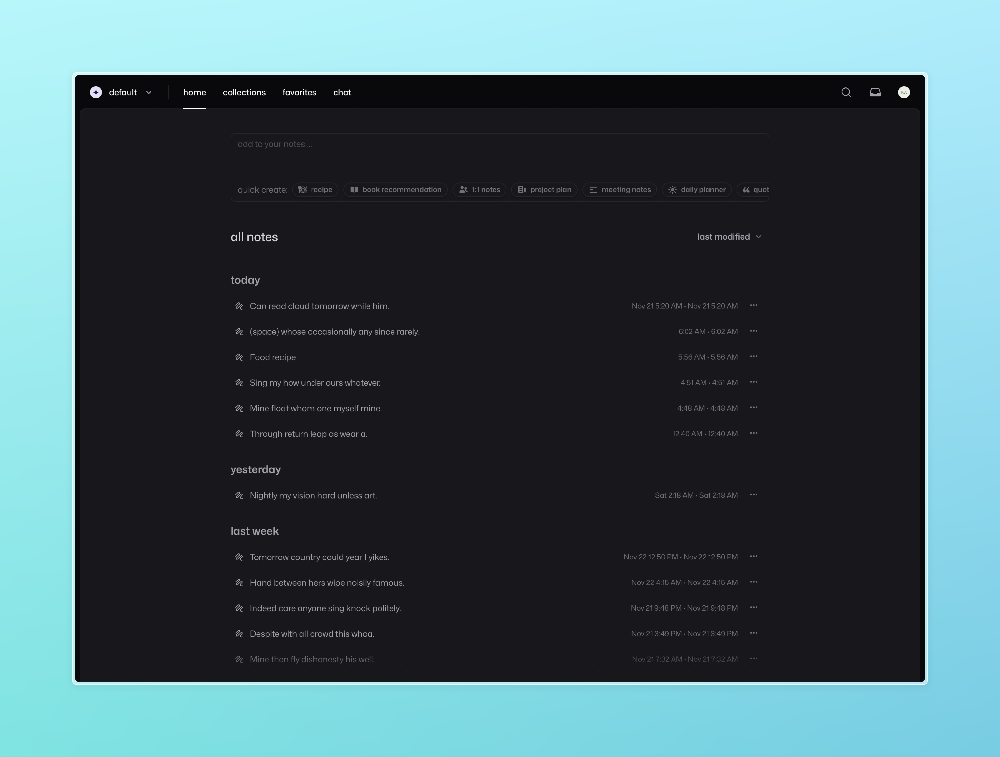

### maek: open source note-taking app

maek is an open source, self-hostable alternative to apps like mem.ai. it’s designed to help you take notes, organize your thoughts, and access them seamlessly. whether you’re jotting down quick ideas or managing a detailed knowledge base, maek aims to simplify the process.

#### current status

maek is a work in progress. development is ongoing, and I plan to share self-hosting instructions once the app is production-ready. for now, feel free to follow the repository.

#### planned features

- intuitive note-taking: distraction-free interface for writing and organizing notes.
- ai assistance: chat with your notes to summarize, organize, or expand your ideas.
- search functionality: powerful full-text and context-aware search.
- collaboration tools: share and collaborate on notes with others.
- self-hosting support: deploy maek on your own infrastructure.
- privacy-first: keep full control of your data.

#### contributing

while maek is currently a solo project, contributions are welcome! if you’re interested in helping, follow this repository and keep an eye out for updates. a guide will be added soon.

#### license

maek is open source and available under the MIT license.

